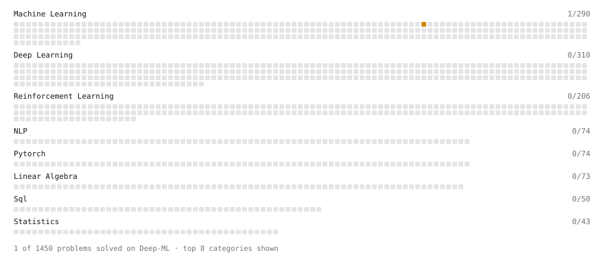

# Deep-ML

My machine learning practice from [Deep-ML](https://www.deep-ml.com). Every solution here was written by hand.

**5** solved · 2 problems · 0 labs · 3 math

[**Browse the interactive portfolio**](https://srj1407.github.io/deep-ml/) to replay this filling in over time.

## Problems

| | Difficulty | Solved | |
| --- | --- | --- | --- |
| [Implement K-Fold Cross-Validation](https://www.deep-ml.com/problems/18) | medium | 2026-09-27 | [solution](problems/0018-implement-k-fold-cross-validation) |
| [Implement Stratified Train-Test Split](https://www.deep-ml.com/problems/275) | medium | 2026-09-26 | [solution](problems/0275-implement-stratified-train-test-split) |

## Math

| | Difficulty | Solved | |
| --- | --- | --- | --- |
| [LOOCV vs $k$-Fold: the Bias-Variance of $k$](https://www.deep-ml.com/math-problems/80) | medium | 2026-09-27 | [solution](math/0080-loocv-vs-k-fold-the-bias-variance-of-k) |
| [Regularization and Generalization](https://www.deep-ml.com/math-problems/31) | medium | 2026-09-27 | [solution](math/0031-regularization-and-generalization) |
| [Training Error, Test Error and the Bayes Rate](https://www.deep-ml.com/math-problems/104) | medium | 2026-09-25 | [solution](math/0104-training-error-test-error-and-the-bayes-rate) |

---

_This file is regenerated by Deep-ML on every push._
